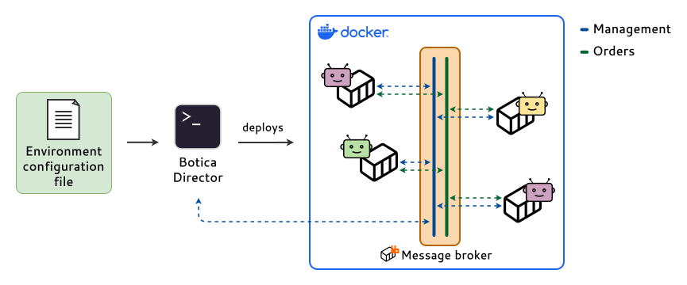
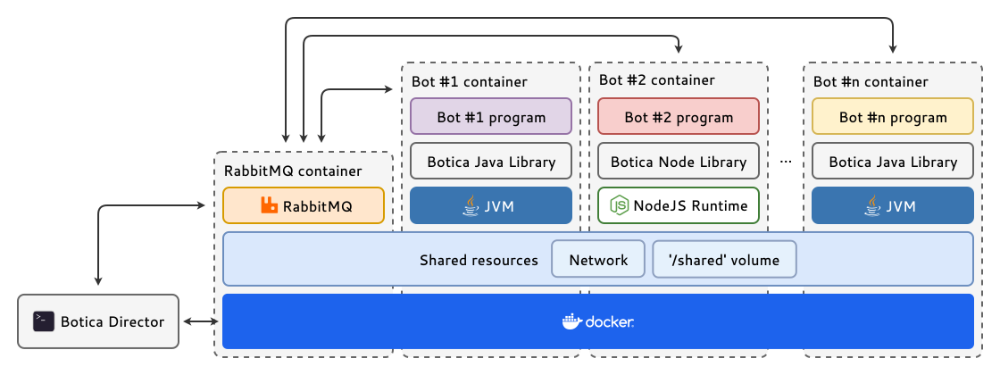

# Botica: The Multi-Bot Collaboration Framework

Build, deploy, and scale your collaborative software bots with ease. Botica provides the framework
for development and the infrastructure for orchestration.



Botica provides a collaboration framework designed to streamline the **development** and
**orchestration** of multi-bot systems. It allows you to define your entire bot infrastructure,
including bot types, instances, and communication patterns, within a **single declarative
configuration file**.

Upon interpreting this configuration, Botica automatically **provisions and manages** the underlying
**message broker**, the necessary **network infrastructure**, the **deployment of each bot** as an
isolated container and the **connections to the message broker and their complete lifecycle**:



## Features

- **Multi-language Support:** Write bots in **Java**, **Node.js** (JavaScript/TypeScript), with more
  languages planned. Official libraries provide idiomatic APIs for each platform.
- **Containerized Architecture:** Every bot runs in its own isolated Docker container, ensuring
  consistent environments and dependency management.
- **Declarative Orchestration:** Define your entire infrastructure in a simple `environment.yml`
  file. No complex orchestration scripts or manual Docker commands required.
- **Built-in Communication:** Botica handles all message routing through a managed broker. Bots
  communicate via high-level "orders" using distributed (work-stealing) or broadcast strategies.
- **Seamless Local Development:** Developing a multi-bot system is as easy as running a single
  command. Botica handles building images from source, setting up networks, and managing the
  lifecycle.

## Requirements

Before you begin, ensure you have the following installed:

- **[Docker Desktop](https://www.docker.com/products/docker-desktop/)** (or Docker Engine): Must be
  installed and running.
- **Java 11 or newer**: Required to run the Botica Director.

## Installation

To start a new Botica project, follow these steps:

1. **Create a directory** for your project.

2. **Download the Director executables**:
   Download `botica-director` and `botica-director.cmd` from the
   [latest release](https://github.com/isa-group/botica/releases/latest) and place them in your
   directory.

    - **Linux / macOS:** You need to mark the `botica-director` file as executable:
      ```bash
      chmod +x botica-director
      ```

3. **Run the Director**: Execute `./botica-director` on **Linux**/**macOS**, or
   `botica-director.cmd` on **Windows** in your project's directory. The first time you run Botica
   Director, it will download the necessary Botica runtime JAR and initialize a default
   `environment.yml` file.

> [!NOTE]
> **Git Integration**
>
> If you are using Git, we recommend committing the `botica-director` and `botica-director.cmd`
> executables, as they are lightweight scripts that download and run the actual Java program.
>
> However, add the `.botica/` directory to your `.gitignore` file, as it contains the heavy runtime
> JAR and temporary files.

## Quick example

This example demonstrates how to build a simple system where a **Node.js generator** creates data
and **Java workers** process it. We'll use Botica's monorepo support to build everything from a
single project.

> [!TIP]
> **Alternative: Separate Repositories**
>
> You can also manage bots in separate repositories. Use
> the [botica-seed-java](https://github.com/isa-group/botica-seed-java)
> or [botica-seed-node](https://github.com/isa-group/botica-seed-node) templates to create
> standalone repositories. Then, instead of `build`, use the `image` property in your
> `environment.yml` to reference your pre-built Docker images.

### 1. Initialize your bots

Use the `init` command to create your bot projects directly in your folder.

```bash
# Create a Typescript/Node.js bot named 'generator'
./botica-director init typescript generator

# Create a Java bot named 'worker'
./botica-director init java worker
```

This creates two directories, `generator` and `worker`, each with a complete project structure and
`Dockerfile`.

### 2. Configure the environment (`environment.yml`)

Edit the generated `environment.yml` to define your system. Notice how we use `build` to point to
our local directories.

```yml
bots:
  generator-bot:
    build: "./generator" # Build the Docker image from this directory
    replicas: 1
    lifecycle:
      type: proactive
      period: 5 # Run task every 5 seconds

  worker-bot:
    build: "./worker" # Build the Docker image from this directory
    replicas: 3
    lifecycle:
      type: reactive
    subscribe:
      - key: "worker_jobs"
        strategy: distributed # Distribute orders among the 3 replicas
```

### 3. Implement bot logic

**Generator Bot (Node.js):** Open `generator/src/index.ts` and add logic to publish data.

```ts
import botica from "botica-lib-node";
import {randomUUID} from "crypto";

const bot = await botica();

bot.proactive(async () => {
  const data = {
    id: randomUUID(),
    timestamp: new Date().toISOString(),
    value: Math.random() * 100
  };

  console.log(`Generated and publishing data: ${JSON.stringify(data)}`);
  await bot.publishOrder("worker_jobs", "process_data", data);
});

await bot.start();
```

**Worker Bot (Java):**
Open `worker/src/main/java/com/example/Bot.java`. The `Bot` class is where your bot logic resides.

```java
public class Bot extends BaseBot {
  private static final Logger log = LoggerFactory.getLogger(Bot.class);

  // This method handles orders with the action "process_data".
  // The key (e.g., "worker_jobs") is defined in environment.yml, so the bot code
  // doesn't need to know it.
  //
  // Note: You can also use any custom class or String as the argument, and Botica
  // will automatically inject it!
  @OrderHandler("process_data")
  public void onProcessData(JSONObject payload) {
    String id = payload.getString("id");
    double value = payload.getDouble("value");

    log.info("Worker {} processing item {}", getBotId(), id);
  }
}
```

> [!WARNING]
> **Note on Java Templates**
>
> The default Java template uses `com.example.Bot` as the main bot class, invoked by
> `com.example.BotBootstrap`. If you rename packages or classes, you must also
> update the `pom.xml` property that points to the bootstrap class.

### 4. Run the system

Simply run the Director again by executing `./botica-director` on **Linux**/**macOS**, or
`botica-director.cmd` on **Windows** in your project's directory.

Botica will automatically:

1. **Build** the Docker images for your bots from the source directories.
2. **Deploy** the message broker and bot containers.
3. **Connect** everything together.

> [!NOTE]
> The first run may take a few minutes as Docker downloads the base images (e.g., Node.js, OpenJDK).
> Subsequent runs will use the cached image, or only take a few seconds to build if you change the
> source code.

## Learn More

This is just a quick glimpse! To fully understand Botica's concepts (Orders, Strategies,
Lifecycle) and learn how to build complex workflows, check out the
**[Getting Started Guide](docs/1-getting-started.md)** and
**[Core Concepts](docs/2-core-concepts/1-the-botica-environment.md)**.

## Documentation

- **[Core concepts](docs/2-core-concepts/1-the-botica-environment.md)**
- **[Getting started guide](docs/1-getting-started.md)**

## Libraries

- [**botica-lib-java**](https://github.com/isa-group/botica-lib-java) - The official Java library.
- [**botica-lib-node**](https://github.com/isa-group/botica-lib-node) - The official Node.js
  library.

## License

This project is distributed under the LGPL v2.1 License.
