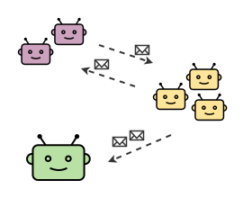

# The concept of a bot

## What is a software bot?

In the context of software engineering, a bot is an autonomous program designed to perform automated
or repetitive tasks. Within Botica, bots are the fundamental building blocks used to create larger,
collaborative systems that can tackle complex workflows.

## Bots in the Botica ecosystem

As you know from the previous page, every bot in a Botica environment runs inside its own isolated
Docker container. This ensures that bots are portable and have their dependencies self-contained.

Bots are organized into two main concepts:

- **Bot type:** A "bot type" is the blueprint for a group of bots that share the same logic and
  configuration. It's defined by a unique name (e.g., `worker-bot`) and is associated with a single
  Docker image.
- **Bot instance/replica:** An "instance" or "replica" is an actual, running container of a specific
  bot type. You can have multiple instances of the same bot type running concurrently to handle
  workloads in parallel.

<p align="center">
  
</p>

Botica follows a **configuration-first** approach. You first define your bot's role, subscriptions,
and behavior within the `environment.yml` file. Then, you implement the business logic for that bot
using one of the official Botica libraries.

## Capabilities of a bot in Botica

Before writing any code, you declare your bot types in the `environment.yml` file. This is where you
configure their high-level behavior and integration into the environment.

### Subscribing to orders

The `subscribe` block defines which message keys your bot type will listen to for incoming orders.
For more details on orders and messaging, refer to
**[Messaging between bots](./3-messaging-between-bots.md)**.

```yml
bots:
  my-listener-bot:
    image: "my-org/my-listener-bot-image"
    subscribe:
      - key: "user_events"
        strategy: broadcast # Delivers each order to all instances
      - key: "processing_jobs"
        strategy: distributed # Delivers each order to only one instance
```

### Mounting files and directories

The `mount` block allows you to share files or directories from your host machine into the bot's
container, which is useful for providing configuration files or reading/writing persistent data.

```yml
bots:
  my-file-processor-bot:
    image: "my-org/file-processor-image"
    mount:
      - source: "./configurations/settings.json"
        target: "/app/config/settings.json"
      - source: "./data-output"
        target: "/shared/output"
        createHostPath: true
```

### Exposing ports

The `ports` block exposes a port from the bot's container to your host machine. This is essential if
your bot needs to accept incoming network connections, such as from a webhook or an API client.

```yml
bots:
  my-api-bot:
    image: "my-org/api-bot-image"
    ports:
      - "8080:3000" # Maps host port 8080 to container port 3000
```

### Setting environment variables

The `environment` block passes environment variables directly into the bot's container, which is a
standard way to provide configuration like API keys or feature flags.

```yml
bots:
  my-service-bot:
    image: "my-org/service-bot-image"
    environment:
      - API_KEY=your_secret_api_key
      - LOG_LEVEL=debug
```

## Bot lifecycle: predefined design patterns

Botica provides `lifecycle` configurations that act as predefined design patterns, making it easy to
create bots with common behaviors without writing boilerplate code.

### Reactive bots

A **reactive bot** is primarily driven by incoming orders from other bots. This is the most common
bot type and the **default lifecycle** if none is specified. Its main purpose is to wait for a
message, perform a task based on that message's content, and optionally publish a result.

You can also specify a `defaultAction`, which allows your bot's code to listen for a default event
without hardcoding the action name.

```yml
bots:
  my-reactive-bot:
    image: "my-org/reactive-bot-image"
    lifecycle:
      type: reactive # This is the default
      defaultAction: "process_new_item"
    subscribe:
      - key: "item_queue"
```

### Proactive bots

A **proactive bot** is designed to initiate tasks on a schedule. Its main action is triggered by a
timer rather than an external order. The schedule (`initialDelay` and `period`) is defined in the
environment file, not hardcoded in your bot, making it easy to change timing without recompiling the
code or rebuilding the image.

While its main trigger is time-based, a proactive bot can still subscribe to and handle incoming
orders, making it suitable for mixed-initiative workflows.

```yml
bots:
  my-proactive-bot:
    image: "my-org/proactive-bot-image"
    lifecycle:
      type: proactive
      initialDelay: 10 # (Optional) Seconds to wait before the first run. Defaults to 0.
      period: 60       # (Optional) Seconds between each run. Defaults to 1.
```

### Bots with custom triggers

If your bot's main trigger is an external event, like an incoming HTTP request from a webhook or a
connection to a WebSocket, you can simply **omit the `lifecycle` block entirely**. Botica will start
your bot, and it will run its main process (e.g., an Express or Spring Boot server) and wait for
external events.

### Unmanaged containers

You can include any additional Docker container, such as a database or a third-party service, in
your Botica environment. To do this, you define it like any other bot but set its lifecycle `type`
to `unmanaged`. This tells the Botica Director to start and network the container but not to attempt
to communicate with it for heartbeats or shutdown requests.

```yml
bots:
  my-database:
    image: "postgres:15"
    lifecycle:
      type: unmanaged
    environment:
      - POSTGRES_PASSWORD=mysecretpassword
    ports:
      - "5432:5432"
```

To learn more about this, see the guide on
**[Integrating auxiliary containers](../3-guides/2-integrating-auxiliary-containers.md)**.

---

## Next steps

Now that you understand what a bot is within Botica, learn how they communicate with each other:

- **[Messaging between bots](./3-messaging-between-bots.md)**
