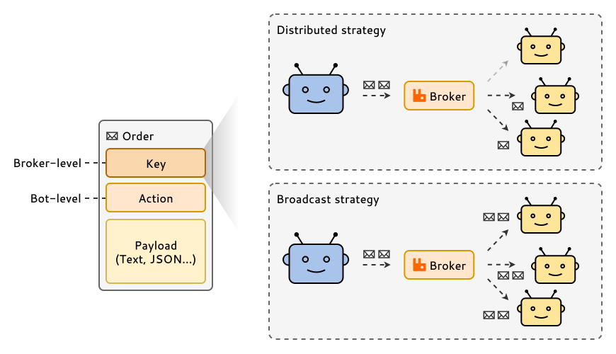

# Messaging between bots

In Botica, bots communicate with each other by sending and receiving messages called **orders**.
This is the primary mechanism for triggering actions, sharing data, and building collaborative
workflows. Botica abstracts away the low-level complexities of the message broker, providing a
simple, high-level system based on orders.

## The structure of an order

Every order consists of three distinct parts, each serving a specific purpose in the communication
pipeline:



### Key (broker-level)

The `key` is a broker-level concept that acts as a named channel or topic for messages. When a bot
publishes an order, it sends it to a specific key. Other bots, in turn, subscribe to one or more
keys to receive orders. This routing mechanism is defined entirely within your `environment.yml`
file, not in your bot's code.

### Action (bot-level)

The `action` is a bot-level concept that serves as an internal routing instruction. When a bot
receives an order from a subscribed key, it uses the `action` to determine which specific piece of
code or handler method should be executed to process the order's payload. This allows a single bot
to handle multiple types of tasks from the same key.

### Payload

The `payload` is the actual data being sent within the order. It can be a simple string, a JSON
object, or any other data format. The Botica libraries provide utilities to automatically handle the
serialization and deserialization of common data types.

## Delivery strategies

When you have multiple instances (replicas) of the same bot type subscribed to a key, you must
define a `strategy` to control how orders are delivered to them. This is a powerful feature for
managing workloads and state.

### Distributed strategy (work-stealing)

This is the **default and most common strategy**. When an order is sent to a key with a
`distributed` subscription, the message broker delivers it to **only one** of the available bot
instances. This pattern is ideal for creating a pool of workers to process a queue of jobs, as it
naturally distributes the load among them.

```yml
bots:
  worker-bot:
    replicas: 3
    subscribe:
      - key: "processing_jobs"
        strategy: distributed # This is the default if not specified
```

### Broadcast strategy

The `broadcast` strategy delivers a copy of every order to **all** running instances of the bot
type. This pattern is useful for tasks that require state synchronization, such as notifying all
bots of a configuration change, sending a "cache invalidation" signal, or triggering a coordinated
action across the entire group.

```yml
bots:
  cache-manager-bot:
    replicas: 3
    subscribe:
      - key: "system_notifications"
        strategy: broadcast
```

## Creating workflows

By combining proactive bots that generate orders, reactive bots that subscribe to keys, and the
strategic use of `distributed` and `broadcast` delivery, you can construct powerful, resilient, and
scalable **process chains**. This is the core principle behind building complex applications with
Botica.

For a practical guide on how to design and implement these workflows, see 
**[Creating process chains](../3-guides/1-creating-process-chains.md)**.

---

## Next steps

Now that you understand how bots communicate, learn how they can share larger files and data that
aren't suitable for orders:

- **[Sharing files between bots](./4-sharing-files-between-bots.md)**