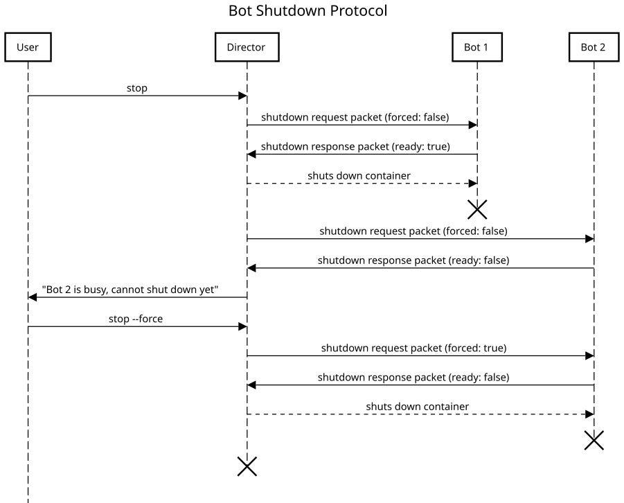

# Shutting down

Botica includes a robust, built-in mechanism for cleanly terminating bots, managed entirely by the
Director. This process ensures that your bots have an opportunity to save their state, finish
critical tasks, and shut down in an orderly manner, which is essential for maintaining data
integrity and system resilience.

The entire shutdown process is a coordinated conversation between the Director and each bot
instance.



## The shutdown process

The shutdown process is always initiated by the **Botica Director**, either when you issue the
`stop` command or when the Director program itself is terminated. The Director sends a shutdown
request to every running bot and waits for a response before proceeding to terminate the container.

This process can operate in two distinct modes:

### Graceful shutdown (default)

This is the standard shutdown procedure, initiated by the `stop` command.

1. The Director sends a **graceful shutdown request** to each bot.
2. Each bot receives the request and executes its predefined shutdown handler logic.
3. Based on its internal state, the bot can respond in two ways:
    - **Ready to shut down:** The bot signals that it has completed its cleanup and is ready to
      terminate.
    - **Cancel shutdown:** If the bot is in the middle of a critical, non-interruptible task, it can
      request to cancel the shutdown.
4. The Director waits for a response. If the bot signals readiness (or doesn't respond within a
   configurable timeout), the Director terminates its container. If the bot requests cancellation,
   the Director will abort the shutdown for that bot.

### Forced shutdown

A forced shutdown is initiated by the `stop --force` command. It is designed to terminate the
environment quickly, even if bots are busy.

1. The Director sends a **forced shutdown request** to each bot.
2. Each bot receives the request and executes its shutdown handler. This gives the bot a brief
   moment to perform emergency cleanup, like quickly saving critical in-memory data.
3. The bot can still send a response, but **any attempt to cancel the shutdown will be ignored by
   the Director**.
4. After a short, non-configurable timeout (3 seconds), the Director will forcibly terminate the
   bot's container, regardless of its response or state.

## Implementing a shutdown handler

You can implement custom logic to respond to shutdown requests by defining a handler in your bot's
code. A common use case is to check if the bot is performing a task and, if so, request that the
shutdown be canceled.

### Java example

This bot maintains an `isBusy` flag. When a shutdown is requested, it checks this flag to decide
whether to accept or cancel the termination.

```java
import es.us.isa.botica.bot.BaseBot;
import es.us.isa.botica.bot.shutdown.ShutdownRequest;
import es.us.isa.botica.bot.shutdown.ShutdownResponse;
import es.us.isa.botica.bot.shutdown.ShutdownRequestHandler;

public class InterruptibleBot extends BaseBot {

  private volatile boolean isBusy = false; // This state changes based on the bot's work

  @ShutdownRequestHandler
  public ShutdownResponse onShutdownRequest(ShutdownRequest request) {
    if (isBusy && !request.isForced()) {
      System.out.println("Still busy, attempting to cancel shutdown.");
      return ShutdownResponse.cancel(); // Request to cancel the shutdown
    }

    System.out.println("Ready to shut down.");
    return ShutdownResponse.ready(); // Signal readiness for shutdown
  }

  // ... other bot logic that sets isBusy to true/false
}
```

### Node.js example

The Node.js equivalent uses a shutdown hook that modifies the `response` object to signal
cancellation.

```ts
import botica from "botica-lib-node";

const bot = await botica();
let isBusy = false; // This state changes based on the bot's work

// ... other bot logic that sets isBusy to true/false

bot.shutdownHandler.onShutdownRequest(async (request, response) => {
  if (isBusy && !request.isForced) {
    console.log("Still busy, attempting to cancel shutdown.");
    response.setCanceled(true); // Request to cancel the shutdown
  } else {
    console.log("Ready to shut down.");
    // No action needed to signal readiness
  }
});

await bot.start();
```

### Advanced handling

These examples show the basic cancellation flow. For more detailed usage, including how to register
handlers programmatically (functionally) or how to perform different cleanup tasks based on whether
the shutdown is forced, please refer to the detailed documentation for each library:

- **[Handling Shutdown Requests in `botica-lib-java`](https://github.com/isa-group/botica-lib-java/blob/main/docs/5-handling-shutdown-requests.md)**
- **[Handling Shutdown Requests in `botica-lib-node`](https://github.com/isa-group/botica-lib-node/blob/main/docs/5-handling-shutdown-requests.md)**

---

## Next steps

This concludes the section on Core Concepts. You now have a solid understanding of the Botica
environment, its components, and their interactions. The next step is to see how these concepts are
applied to build practical, real-world workflows.

- **[Creating Process Chains](../3-guides/1-creating-process-chains.md)**
